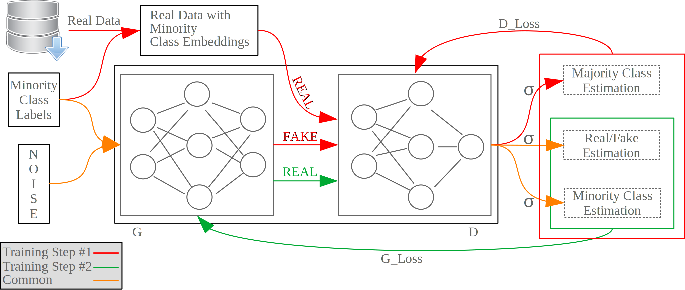

# Evasion Generative Adversarial Network




## Prerequisites
* Tensorflow
* Keras
* Numpy
* For the rest of the packages please refer to header.py file inside the project directory.


## Cite this Work
```
Randhawa, Rizwan Hamid, et al. "EVAGAN: Evasion Generative Adversarial Network for Low Data Regimes." arXiv preprint arXiv:2109.08026 (2021)
```
### Bibtex
```
@article{randhawa2021evagan,
  title={EVAGAN: Evasion Generative Adversarial Network for Low Data Regimes},
  author={Randhawa, Rizwan Hamid and Aslam, Nauman and Alauthman, Muhammad and Rafiq, Husnain and Khalid, Muhammad},
  journal={arXiv preprint arXiv:2109.08026},
  year={2021}
}

```